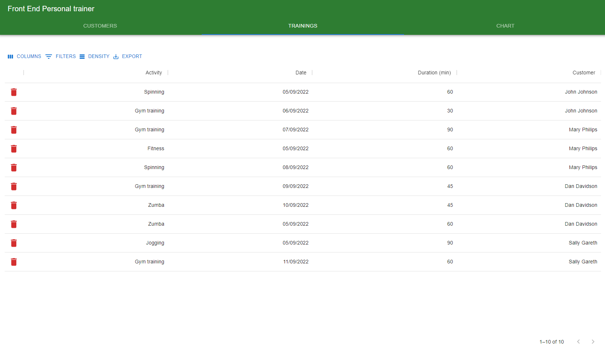

# Personaltrainer

<h2>About</h2>
This web application is made by Jong Lau for Haaga-Helias Front End Development course as a course project work. The project asks the students to make a front end for a database API made and provided by the teacher which is shared between all students, so if my application does not work for some reason, it is most likely because some other student inputted something invalid to the database. (5/9/2022 last checked, application works)

 
 
The application is made with JavasScript, React, MaterialUI and AG Grid. Additional imports include some pictures for buttons and Recharts for the chart tab of the application. The application should have all needed/wanted functionalities any typical list type application has, like adding, deleting, sorting, filtering, exporting data, resizing flexibility and pages. Since this course wanted us to make a web application, the phone view was not considered here hence it is almost unusable in phone.

 

**The pictures shown below are quite low quality without clicking on them to see the actual picture file**

<h1>Customers Tab and Trainings Tab</h1>

 

<h1>Chart Tab</h1>

 
<h1>Adding New Customer and Editing Functionalities</h1>

 

 
<h1>Addng New Training For Customer</h1>

